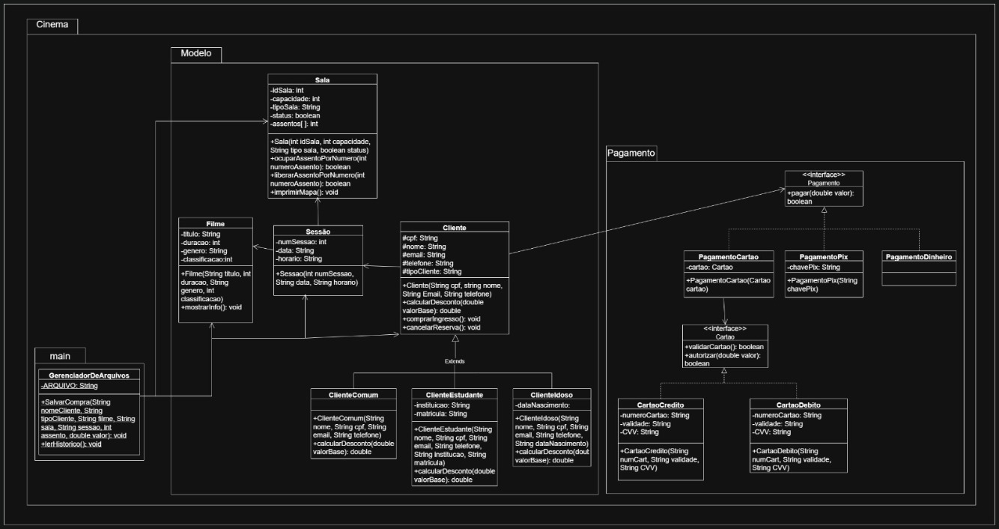
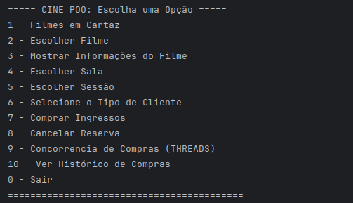

# 🎬 CINE POO

### Bem-vindo ao **CINE POO**, um sistema de venda de ingressos de cinema desenvolvido com foco em **Programação Orientada a Objetos (POO)**, **Herança**, **Concorrência** e **Persistência de Dados** para gerenciar a reserva de assentos de forma segura e eficiente.

---

##  📐 UML da Aplicação



---

## 🎮 Menu da Aplicação



---

## 💻 Funcionalidades Principais

### O sistema oferece uma experiência completa de cinema, permitindo ao usuário:

- ### **Gestão de Sessões:** Cadastro e visualização de filmes, salas e horários.
- ### **Tipos de Cliente:** Sistema de descontos baseado em hierarquia de classes (Comum, Estudante, Idoso).
- ### **Reserva de Assentos:** Mapa visual de assentos (`Sala.imprimirMapa()`) e escolha do lugar desejado.
- ### **Processo de Compra:** Seleção da forma de pagamento (Cartão de Crédito, Débito, PIX ou Dinheiro) com aplicação automática de descontos.
- ### **Histórico de Compras:** Salvamento e leitura de todas as transações em arquivo de texto.
- ### **Cancelamento:** Liberação de assento e reset das informações da reserva.
- ### **Simulação de Concorrência (Threads):** Demonstração segura da reserva de um mesmo assento por múltiplos clientes simultâneos, utilizando sincronização.

---

## 🏗️ Estrutura do Projeto

### O projeto segue uma arquitetura orientada a objetos, organizada em pacotes para separar responsabilidades:
```
CinePOO/
│
├── src/
│   └── cinema/
│       ├── concorrencia/          # Implementação de threads e concorrência
│       │   └── TentativaDeCompra.java
│       │
│       ├── main/                   # Classe principal e gerenciamento de arquivos
│       │   ├── Main.java
│       │   └── GerenciadorArquivos.java Leitura/Escrita de histórico
│       │
│       ├── modelo/                 # Classes de domínio (entidades)
│       │   ├── Cliente.java        # Superclasse com herança
│       │   ├── ClienteComum.java   # Subclasse - sem desconto
│       │   ├── ClienteEstudante.java  # Subclasse - 50% desconto
│       │   ├── ClienteIdoso.java   # Subclasse - 50% desconto
│       │   ├── Filme.java
│       │   ├── Sala.java
│       │   └── Sessao.java
│       │
│       └── pagamento/              # Sistema de pagamento (interfaces e implementações)
│           ├── Cartao.java         # Interface
│           ├── CartaoCredito.java
│           ├── CartaoDebito.java
│           ├── Pagamento.java      # Interface
│           ├── PagamentoCartao.java
│           ├── PagamentoDinheiro.java
│           └── PagamentoPix.java
│
├── historico_ingressos.txt         # [NOVO] Arquivo gerado automaticamente
├── .gitignore
├── CinePOO.iml
└── README.md
```

---

## 🌟 Conceitos Chave de POO e Concorrência

### Este projeto aplica de forma prática diversos **pilares da POO** e conceitos de **concorrência**:

### 1️⃣ Abstração,  Herança e Polimorfismo
- **Interfaces:** Uso das interfaces `Pagamento` e `Cartao` para definir contratos comuns.
- **Herança:** 
    - A classe `Cliente` atua como **superclasse**, definindo atributos e métodos comuns a todos os tipos de clientes
    - As classes `ClienteComum`, `ClienteEstudante` e `ClienteIdoso` são **subclasses** que herdam de `Cliente`
    - Uso de `extends` para estabelecer a relação de herança: `public class ClienteEstudante extends Cliente`
    - Palavra-chave `super()` para invocar o construtor da superclasse
    - Modificador `protected` permite que subclasses acessem atributos da superclasse mantendo encapsulamento
- **Polimorfismo:** 
    - **No sistema de pagamento:** A variável `Pagamento pagamento` pode referenciar diferentes objetos (`PagamentoPix`, `PagamentoDinheiro`, `PagamentoCartao`), permitindo que o método `pagar(valor)` se comporte de forma específica para cada tipo
    - **No sistema de clientes:** Uma referência do tipo `Cliente` pode apontar para qualquer subclasse (`ClienteComum`, `ClienteEstudante`, `ClienteIdoso`), permitindo que o método `calcularDesconto()` execute comportamentos diferentes dependendo do tipo real do objeto em tempo de execução

### 2️⃣ Herança e Sobrescrita
- **Superclasse:** `Cliente` define atributos e comportamentos comuns (nome, CPF, email, telefone).
- **Subclasses:** `ClienteComum`, `ClienteEstudante` e `ClienteIdoso` herdam de `Cliente` e sobrescrevem o método `calcularDesconto()`:
    - `ClienteComum`: Sem desconto (retorna valor base)
    - `ClienteEstudante`: 50% de desconto
    - `ClienteIdoso`: 50% de desconto
- **`@Override`:** Demonstra sobrescrita de métodos para comportamentos específicos de cada tipo de cliente.

### 3️⃣ Encapsulamento
- Dados sensíveis, como `capacidade` da `Sala` ou `titulo` do `Filme`, são mantidos como **`private`** e acessados apenas por métodos públicos (`getters` e `setters`), garantindo integridade e segurança.
- Atributos **`protected`** na classe `Cliente` permitem acesso pelas subclasses, mantendo encapsulamento adequado.

### 4️⃣ Concorrência e Sincronização
- **Thread Safety:** A classe `TentativaDeCompra` implementa `Runnable` para simular compras simultâneas.
- **Exclusão Mútua:** O bloco `synchronized (salaAlvo)` garante que apenas uma thread por vez execute o método crítico `ocuparAssentoPorNumero()`, evitando que dois clientes reservem o mesmo assento.

### 5️⃣ Persistência de Dados (Arquivos)
- **Escrita em Arquivo:** A classe `GerenciadorArquivos` utiliza `FileWriter` e `BufferedWriter` para salvar cada compra realizada no arquivo `historico_ingressos.txt`.
- **Leitura de Arquivo:** Método `lerHistorico()` usa `FileReader` e `BufferedReader` para exibir todo o histórico de transações.
- **Tratamento de Exceções:** Uso de `try-catch` para lidar com `IOException` durante operações de I/O.
- **Formato do Histórico:** Cada compra é registrada com data/hora, dados do cliente, filme, sala, assento e valor pago.

---

## ⚡ Tecnologias Utilizadas

- Java 11+
- Threads e sincronização (`synchronized`)
- Programação Orientada a Objetos (POO)
- Manipulação de Arquivos (I/O) com `java.io.*`
- Date/Time API (`java.time.LocalDateTime`)

---

## 📋 Exemplo de Uso

### 1. Execute o programa e escolha o tipo de cliente (opção 6):
```
===== SELECIONAR TIPO DE CLIENTE =====
1 - Cliente Comum (sem desconto)
2 - Estudante (50% de desconto)
3 - Idoso (50% de desconto)
```

### 2. Selecione filme, sala e sessão (opções 2, 4, 5)

### 3. Finalize a compra (opção 7) - o desconto será aplicado automaticamente:
```
Valor do ingresso: R$22.50  (com desconto de estudante)
✓ Compra salva no histórico!
```

### 4. Visualize o histórico completo (opção 10):
```
===== HISTÓRICO DE COMPRAS =====
========================================
Data/Hora: 23/11/2025 17:30:45
Cliente: Chris (Estudante)
Filme: Wicked: Parte 2
Sala: Sala 1 | Assento: 15
Sessão: 19:30
Valor pago: R$ 22.50
========================================
```

---

## 🎯 Principais Melhorias Implementadas

✅ **Sistema de Herança** - Hierarquia de classes Cliente com polimorfismo  
✅ **Descontos Automáticos** - Cálculo baseado no tipo de cliente  
✅ **Persistência de Dados** - Histórico permanente de todas as compras  
✅ **Leitura/Escrita de Arquivos** - Implementação completa de I/O  
✅ **Tratamento de Exceções** - Validações robustas em todo o sistema

---

## **👨‍💻 Desenvolvido por:**

#### Giuliana Batistella | Matheus Henrique | Vitoria Cássia | Warley Ruivo

---